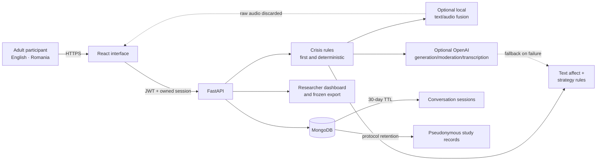

# AffectLab canonical evidence package

This small package is the repository-level source for dissertation figures, tables, and demonstration claims. The dissertation itself should cite or adapt it rather than duplicate changing implementation notes.

## Architecture and data flow

Safety checks precede model generation. Raw audio is processed in memory and is not stored. Conversation sessions and minimized research records have separate retention policies. Research exports exclude names, email, conversation text, audio, and takeaways.

## Package contents

- [Model card](model-card.md): text, audio, and calibrated late-fusion artifacts.
- [System card](system-card.md): intended use, prohibited use, privacy, safety, and limitations.
- [Canonical results and provenance](results-and-provenance.md): the only compact headline table to use in slides.
- [Reproduction and demonstration](reproduction-and-demo.md): training references, evidence capture, offline demo, and presentation runbook.
- `synthetic-demo.json`: fictional, redistribution-safe demonstration wording.

The private IEMOCAP dataset, row-level predictions, and model weights are intentionally excluded.
