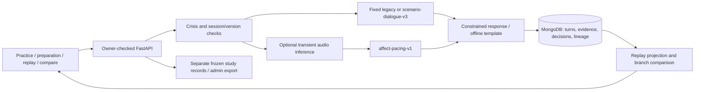
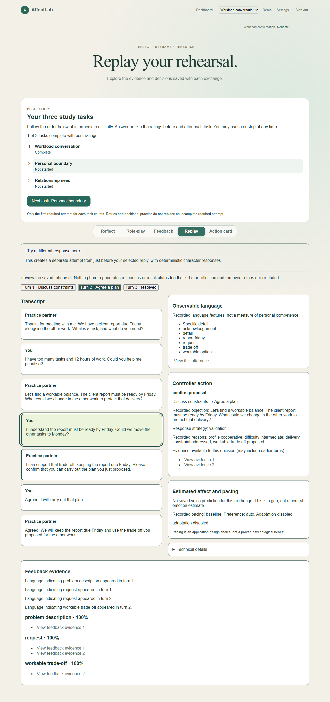
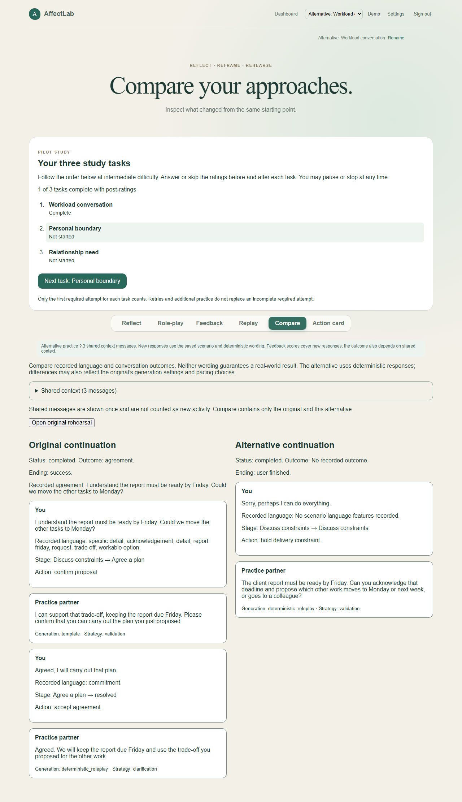
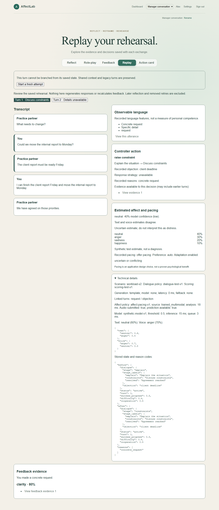

# Integrated engineering demonstration (v1)

All conversations, ratings entered by automation, and prediction fixtures in this
demonstration are synthetic. They are not participant outcomes. The contribution
evaluated here is a versioned dialogue controller, bounded affect pacing, saved
evidence, replay, branching, and personal preparation. Supervisor/course approval
of this dissertation framing is still pending; no approval is implied.

## Reproduce from a clean checkout

Requirements: Python 3.11+, Node compatible with the checked-in frontend lockfile,
and a running local MongoDB. From the repository root in PowerShell:

```powershell
py -m venv .venv
.venv/Scripts/python.exe -m pip install -r backend/requirements.txt
Set-Location frontend
npm.cmd ci
npx.cmd playwright install chromium
Set-Location ..
.venv/Scripts/python.exe scripts/evaluate_engineering.py
.venv/Scripts/python.exe scripts/engineering_smoke.py
```

The native smoke runner builds the frontend, serves it on localhost:15173, starts
FastAPI on localhost:18000, and uses a freshly generated disposable MongoDB
database. Both ports must be free. `TEST_MONGODB_URI` can select a test MongoDB
server; do not point this at a production deployment. The runner overrides cloud
generation, transcription, email, and inference settings and deletes only its
generated database after stopping its own processes. It does not restart an
existing app or MongoDB. Each browser-requested restart actually stops and
relaunches the owned backend process while MongoDB remains running.

The smoke checks the frozen required workload journey, research export exclusion,
an enhanced three-turn negotiation, an aborted request with draft recovery,
read-only replay, branch continuation, comparison, action-card persistence and
source preservation across restart. The historical Docker runner remains usable
via `npm.cmd run test:e2e:full-stack` in `frontend`; Docker is not required by the
native runner. Generated JSON records the result, timing and restart PIDs. Backend
logs are local diagnostics, not dissertation artifacts.

For the desktop/mobile fixture checks and synthetic uncertainty screenshot:

```powershell
$env:AFFECTLAB_EVIDENCE_DIR=(Resolve-Path docs/evidence-package/generated).Path
Set-Location frontend
npx.cmd playwright test replay.spec.ts branching.spec.ts preparation.spec.ts practice.spec.ts workspace-recovery.spec.ts --workers=2
```

These browser fixtures cover empty/legacy replay, unavailable parents, stale
writes, loading failures and retry, transcription fallback, prepared-brief editing,
copy/download, keyboard access and accessibility. They do not substitute for the
real backend smoke. Screenshots may be regenerated; timing varies by machine.

## Guided presentation (about ten minutes)

1. Start the local interactive demo using [the offline runbook](reproduction-and-demo.md).
   Say explicitly: “This is a fictional conversation and deterministic offline
   generation.” Administrative collection controls live in `/research`; they are
   not part of rehearsal. The study checklist is visible only to enrolled accounts.
2. Choose additional Workload conversation, intermediate, cooperative. Skip optional
   ratings. Send: “I have too many tasks and 12 hours of work. Could you help me
   prioritise?” Show the objection and current stage.
3. Send: “I understand the report must be ready by Friday. Could we move the other
   tasks to Monday?” Then “Agreed, I will carry out that plan.” Explain that the
   controller requires addressing the constraint and explicit confirmation.
4. Open Replay, select Turn 2 and follow an evidence link. Show the saved stage,
   action and wording. Replay reads saved records; it does not call a model.
5. Select “Try a different response here”, submit “Sorry, perhaps I can do
   everything.” Finish and compare. Shared context appears once. This alternative
   fails to propose a workable trade-off; it is not a prediction about a real manager.
6. Save an Action card and reload. Explain that it is editable preparation,
   separate from scores, and contains no verified commitment by another person.
7. Show the **synthetic** uncertainty screenshot below and the `matching`,
   `disagreement`, and `uncertain` entries in the evaluation JSON. Matching
   high-confidence sadness permits acknowledgement; disagreement/low confidence
   offers a pacing choice. These probabilities are injected engineering fixtures,
   not recorded speech or a new trained-model experiment. Actual voice inference
   requires the private artifacts in the model card.
8. Show the text-only/missing-model baseline results and the real smoke restart
   manifest. The demo remains usable with no cloud key or trained model. Network
   loss still prevents saving; the interface preserves the draft for retry.
9. Optionally prepare a fictional housemate conversation with the four-input form,
   edit its possible objection, confirm the brief, practise and save a card. Custom
   preparation uses the documented generic flow, not arbitrary scenario simulation.

## Architecture and sequence



```mermaid
sequenceDiagram
  participant U as User
  participant A as API
  participant C as Controller
  participant D as MongoDB
  U->>A: Text, optional audio, request ID, expected version
  A->>C: Validate owner/version; safety; bound prediction
  C->>C: Dialogue action + bounded pacing + response
  C->>D: Atomic versioned turns/evidence/decision snapshots
  D-->>U: Saved exchange
  U->>A: Read replay
  A->>D: Read saved rehearsal boundary and decisions
  D-->>U: Evidence-linked replay (no generation)
  U->>A: Branch before selected response
  A->>D: Separate retry with copied context and pre-turn state
  D-->>U: New session; original preserved
```

## Policy and evidence map

| Claim | Implementation | Reproducible evidence |
| --- | --- | --- |
| Multi-stage workload, boundary, relationship | `scenario_dialogue.py`, `workload_dialogue.py` | `engineering-v1.json` dialogue trajectories; `test_scenario_dialogue.py` |
| Bounded affect pacing, user choice first | `affect_pacing.py`, `conversation_service.py` | Seven authored affect cases; `test_affect_pacing.py` including actual inference failure fallback |
| Replay is saved evidence | `services/replay.ts`, `ConversationReplay.tsx` | Replay browser tests, real smoke screenshot |
| Branch preserves original and copied context | `branching.py`, `BranchComparison.tsx` | Backend branch tests, real restart smoke |
| Prepared generic flow and separate action card | Preparation/card services and components | Backend and browser preparation tests, smoke card persistence |
| Frozen required tasks remain unchanged | Legacy role-play and study services | Required-task backend/browser regression and smoke export assertions |

| Condition (eligible active enhanced rehearsal) | Pacing action |
| --- | --- |
| Explicit user preference | Selected pace; keep going uses baseline |
| Adaptation disabled or prediction absent/failed | Baseline with recorded reason |
| Confidence below threshold | Offer pacing choice |
| Text/audio disagree | Offer pacing choice |
| Supported matching anger/sadness estimates | Brief acknowledgement |
| Other supported matching labels | Baseline |
| Safety override, ended or ineligible session | Baseline/safety handling before adaptation |

## Results and limitations

[Versioned engineering output](generated/engineering-v1.json) includes the authored
inputs, semantic annotations, predictions, decisions, environment and source
SHA-256 hashes. Five of five enhanced stage trajectories match expectations.
The fixed controller sees the same ordered input lists and stops at its own
terminal point; unconsumed inputs are not treated as role-play. This exposes
different completion rules, not superior human communication outcomes.

| Authored case | Fixed controller | Enhanced controller |
| --- | --- | --- |
| Workload proposal and confirmation | Completes after input 1 | Constraints → agree → resolved |
| Workload refusal to confirm | Completes after input 1 | Constraints → agree → remains at agree |
| Clear boundary and respectful repetition | Active after both inputs | Pressure → resolved (boundary held) |
| Relationship practical next step | Completes after input 1 | Perspective → agree → resolved |
| Relationship unresolved ending | Completes after input 1 | Perspective → unresolved |

The twelve feature annotations yield 5 true positives, 4 true negatives, 1 false
positive and 2 false negatives. Reported speech (“They said I need…”) is mistaken
for the speaker's need; “shift” and an indirect refusal are missed. These small,
authored cases are deliberately diagnostic, not a held-out accuracy estimate.
All seven affect action expectations match. Missing-model cases here test the
policy's fallback decision; actual failing model calls are covered in backend tests.

Latency samples measure the in-process deterministic service with memory storage,
excluding HTTP, MongoDB and trained inference. Read the recorded p50/p95 and sample
count in JSON (p95 uses the lower order statistic at 0.95 ? (n ? 1)); this small run is not a load test or a production latency promise.
The [smoke manifest](generated/smoke-v1.json) measures total journey runtime separately;
both journeys passed with two actual backend process restarts against MongoDB 8.0.1.
No online generation
variability experiment was run: these comparisons use deterministic responses.

Held-out model measurements remain in [canonical results and provenance](results-and-provenance.md).
For example, context-text macro F1 is 0.7332 and equal-weight fusion macro F1 is
0.7883 on the reported IEMOCAP evaluation. They are historical dataset results,
not accuracy on these conversations. Private artifacts were not rerun here;
artifact provenance limitations in that page still apply. No new live-model
accuracy, usability improvement, therapeutic benefit or communication transfer is
established. Supervisor framing approval remains an external follow-up.

## Representative screenshots

These are fictional demonstrations. The first two come from the compiled app and
real API; the uncertainty view uses explicitly synthetic saved prediction fixtures.








## Validation record ? 28 September 2026

- Backend: 253 tests passed with `TEST_MONGODB_URI=mongodb://localhost:27017`.
- Compiled frontend + real FastAPI/MongoDB: 2 journeys passed, with 2 actual backend restarts; see the versioned smoke manifest.
- Focused desktop/mobile browser suite: 76 passed in the clean final run, including keyboard/accessibility and loading/error/empty recovery. An earlier runner hung during Vite teardown; the final run reused a separately started Vite service and exited successfully.
- Frontend production build and ESLint passed. Backend Ruff (`cd backend; ../.venv/Scripts/python.exe -m ruff check app tests`) and both new scripts passed Ruff. Diff whitespace checks passed.
- Docker was unavailable on the validation machine; its existing runner was retained but not executed. The native runner was exercised on Windows 11, Python 3.14.3 and MongoDB 8.0.1.
